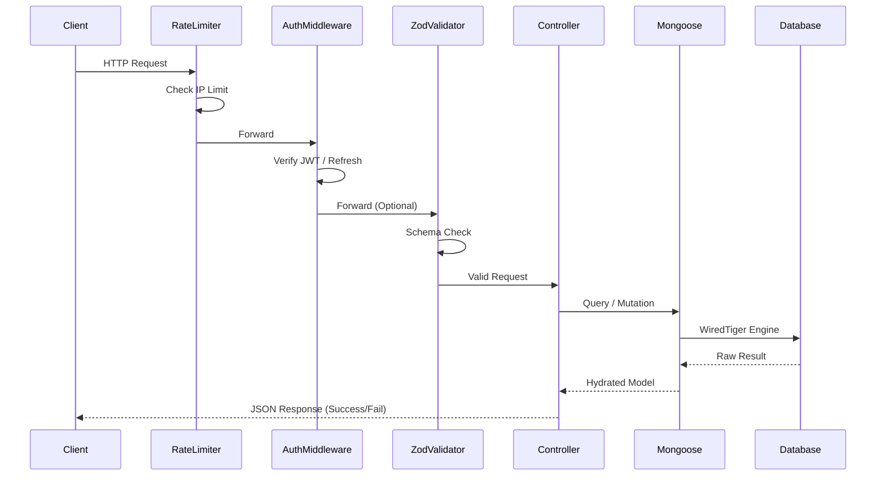

# API Request Lifecycle Diagram

This diagram illustrates the flow of a standard request through the Earnitix backend.

## 🛠️ Internal Hooks
1.  **Request Logging**: `morgan` (if implemented) or custom logger.
2.  **Error Bubbling**: `next(error)` sends to `errorHandler.js`.
3.  **Sanitization**: `toJSON` hook on schemas before response.
