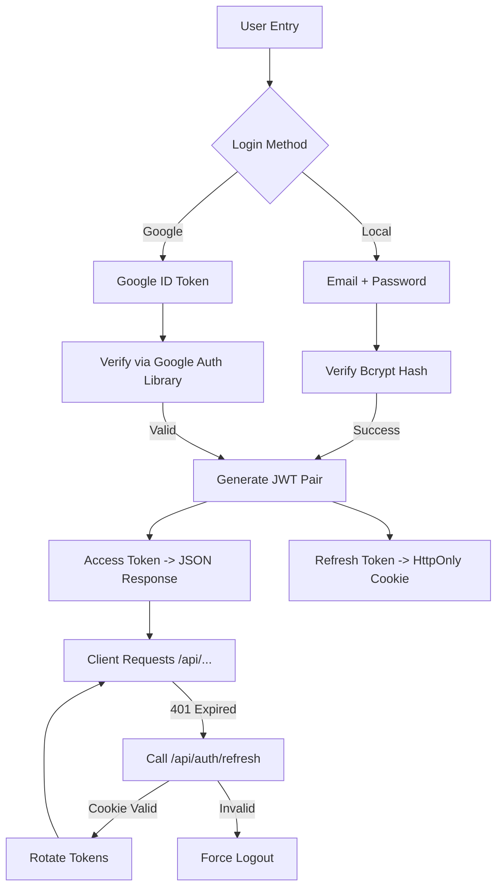

# Authentication & Session Flow

Earnitix uses a dual-token strategy (JWT) combined with OTP and Google OAuth.

## 🔐 Security Features
- **OTP Logic**: Email verification required for local signups.
- **Fingerprinting**: `deviceFingerprint` used to link sessions to hardware.
- **Auto-Logout**: 403 response interceptor triggers session clearing if user is blocked.
