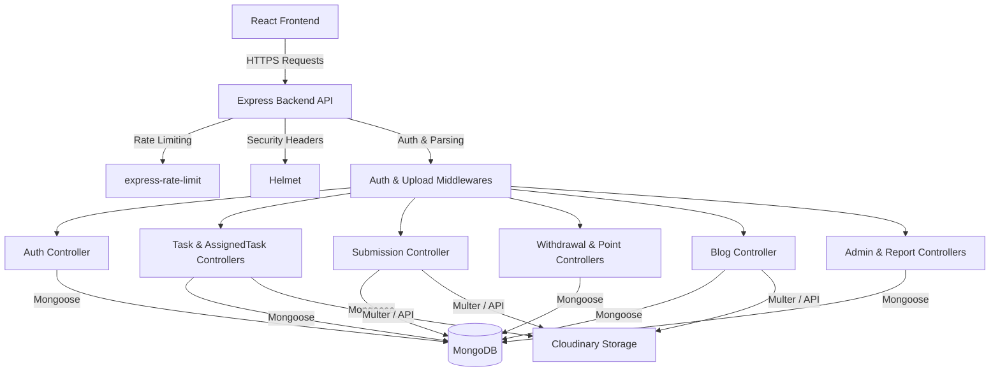

# Earntix System Overview & Architecture

## 1. Purpose
Earntix is a comprehensive reward-based platform where users complete assigned or public tasks (e.g., surveys, tests, data entry, blogs) in exchange for virtual coins. These coins can subsequently be frozen and withdrawn into real-world currency via bank transfers.

The application serves two main actors:
1. **Users:** Complete tasks, upload proof (submissions), track points, and request withdrawals.
2. **Admins:** Create/assign tasks, review/approve submissions, manage KYC, and process withdrawals.

## 2. Global Architecture Stack

The Earntix platform follows a modern MERN architecture (MongoDB, Express.js, React, Node.js), integrating with external services like Cloudinary for blob storage.

*   **Frontend:** React (Vite-based), utilizing contextual state management and React Router for SPA navigation.
*   **Backend:** Express.js running on Node.js.
*   **Database:** MongoDB Atlas (accessed via Mongoose ODM).
*   **Storage:** Cloudinary (for task attachments, submission proofs, blog images, and gallery management).
*   **Authentication:** JWT (JSON Web Tokens) with short-lived access tokens and stateful refresh tokens.

---

## 3. Dependency & Data Flow Map

## 4. Backend Structure

The backend (`/backend/src`) is strictly structured using the MVC pattern (Model-View-Controller) without the View layer, serving as a RESTful API.

*   `/config`: Environment loading and MongoDB connection logic.
*   `/controllers`: Business logic mapping to API routes.
*   `/middleware`: Security, authentication, file upload processing (`multer`), and global error handling.
*   `/models`: Mongoose schemas defining the database shape.
*   `/routes`: Express routers linking HTTP verbs and paths to controllers.
*   `/services`: Reusable external integrations (e.g., Cloudinary API, token generation, caching).
*   `/utils`: Helpers like logging (`winston`), hashing, and generic responses.

### 4.1 Global Middleware & Security
The entry point (`app.js`) implements critical safety barriers:
1.  **HTTPS Enforcement:** Redirects to HTTPS in production environments.
2.  **Helmet:** Secures HTTP headers.
3.  **CORS:** Strictly controls cross-origin requests, relying on allowed origins configured via environment variables.
4.  **Sanitization:** `express-mongo-sanitize`, `xss-clean`, and `hpp` protect against injection attacks.
5.  **Event Loop Monitoring:** A custom `isOverloaded` middleware returns 503s if the event loop lags >200ms, preventing catastrophic cascading failures.

## 5. Database Schema Overview

The MongoDB cluster operates 12 distinct collections:
- `users`: Stores user profiles, authentication state, balances (points/frozenPoints), and KYC data.
- `tasks`: Public tasks available to all qualified users.
- `assignedtasks`: Private, one-to-one tasks directly mapped to specific users.
- `submissions`: User-uploaded proofs of task completion containing file hashes for deduping.
- `withdrawals`: Financial transactions representing points converted to fiat currency.
- `blogs`: User-generated blog articles awaiting admin approval.
- `announcements`: Global or targeted notifications for users.
- `adminlogs`: Detailed audit trails of all administrative actions.
- `skillcategories`: Taxonomies for categorizing tasks.
- `reports`: User analytics.
- `pointhistories`: Ledger of point increments and decrements.

## 6. Next Steps for New Developers

If you are joining the project, read the documentation in this order:
1. `02-authentication.md` - Understand how tokens and sessions work.
2. `05-task-system.md` & `06-submission-system.md` - The core loop of the application.
3. `07-coin-system.md` - How money is managed safely without double-spending.
4. `08-storage-system.md` - How files are uploaded and cleaned up.
