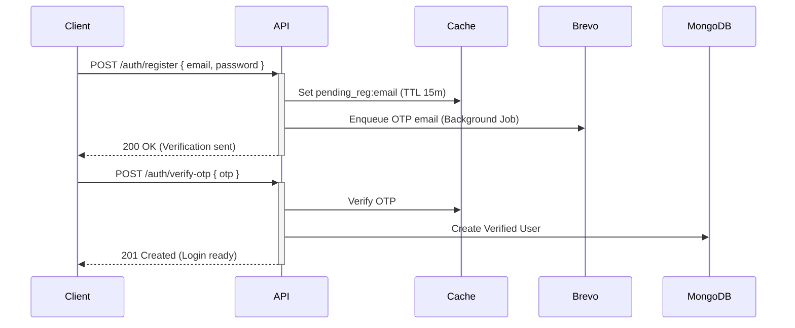

# Earntix Authentication Architecture

## 1. Overview
Earntix uses a dual-token (Access + Refresh) JWT authentication system combined with session-less state mapping. Authentication supports two pathways:
1. **Local Authentication:** Email/Password via OTP verification.
2. **OAuth2:** Google Sign-In (`@google-cloud/recaptcha-enterprise` and `google-auth-library`).

---

## 2. Token Lifecycle

*   **Access Token (`accessToken`):**
    *   **Lifespan:** 15 minutes.
    *   **Storage:** In-memory on the client (React Context/Redux). NEVER stored in LocalStorage due to XSS vulnerability risks.
    *   **Format:** Standard JWT containing `{ userId, role }`.
*   **Refresh Token (`refreshToken`):**
    *   **Lifespan:** 7 days.
    *   **Storage:** HTTP-only, secure, `SameSite=Strict/Lax` cookie.
    *   **Validation:** Verified against the database record (`user.refreshToken`). If the cookie token doesn't match the database token, the session is forcefully invalidated (protects against token theft/reuse).

### 2.1 The Refresh Flow
1. Client makes API call.
2. If API returns `401 Unauthorized` with `code: 'TOKEN_EXPIRED'`, the frontend interceptor (`axios`) catches it.
3. The client silently calls `GET /api/auth/refresh`.
4. The server validates the HTTP-only cookie, checks the DB, issues a new `accessToken`, and rotates the `refreshToken`.
5. The original request is retried with the new access token.

---

## 3. Local Registration Flow (OTP Pipeline)

Registration is completely separated from immediate database writes to prevent database bloat from unverified accounts.



**Security Note:** 
- Passwords are hashed using `bcrypt` (10 rounds for standard registration, 12 rounds for admin creation/reset).
- OTP requests are strictly rate-limited using an in-memory cache limit of 4 requests per day per email.

---

## 4. Google OAuth Flow

The Google OAuth flow parallelizes Google token verification and database lookups to maximize login speed.

1.  Client retrieves Google `credential` string.
2.  Server uses `verifyIdToken` (fast local verification) as primary.
3.  Falls back to Google `userinfo` endpoint if the token is an access token instead of an ID token.
4.  If user exists, issue tokens. If user does not exist, provision a verified account immediately and set `authProvider = 'google'`.

---

## 5. Security & Rate Limiting

### 5.1 Admin Bypass Protection
The global `apiLimiter` protects against mass requests, while the `authLimiter` strictly limits logins. 
> [!WARNING]
> Previously, the `authLimiter` had a hardcoded bypass for the admin email. This was **removed** during the Master Audit to prevent brute-force attacks against the admin account. Admins are now subject to rate limits.

### 5.2 Brute Force Protection
- `checkLoginAttempts`: Tracks failed/successful logins in memory via cache.
- Limits a user to 15 login attempts per minute.
- Blocks the IP/email combination for 30 minutes if the limit is breached.

### 5.3 Event Loop Optimization
The main `auth` middleware runs on *almost every* API request. To prevent event loop starvation and memory bloat:
```javascript
// DO NOT do this (Hydrates massive Mongoose object)
const user = await User.findById(id).select('-passwordHash');

// INSTEAD do this (Returns pure JSON object with only necessary fields)
const user = await User.findById(id).select('isBlocked blockedUntil role').lean();
```
All route handlers rely on `req.user._id` (which is present in the lean object) rather than calling `req.user.save()`.

---

## 6. Common Errors & Troubleshooting

| Error Message | HTTP | Solution |
| :--- | :--- | :--- |
| `Token expired.` | 401 | Interceptor should catch this and call `/api/auth/refresh`. |
| `Invalid refresh token` | 401 | The user's session was invalidated (e.g., logged out on another device). Force redirect to `/login`. |
| `Please use Google login` | 400 | User originally signed up with Google. They must use the Google button. |
| `Account has been blocked` | 403 | Admin manually blocked the user via dashboard. |
| `Too many login attempts` | 429 | Wait 30 minutes. Cached in `login_attempts:<email>`. |
